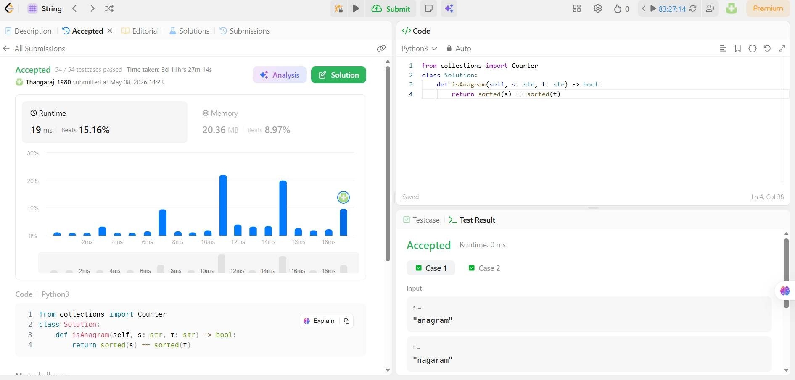
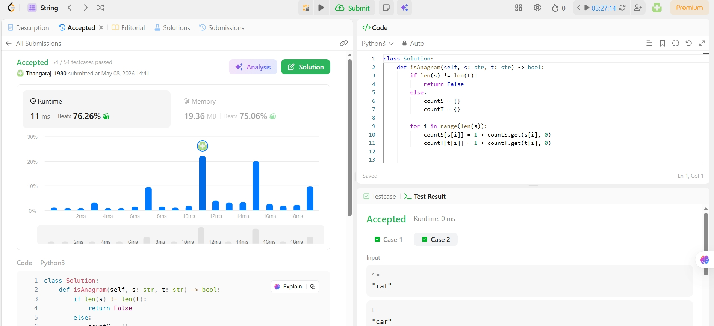
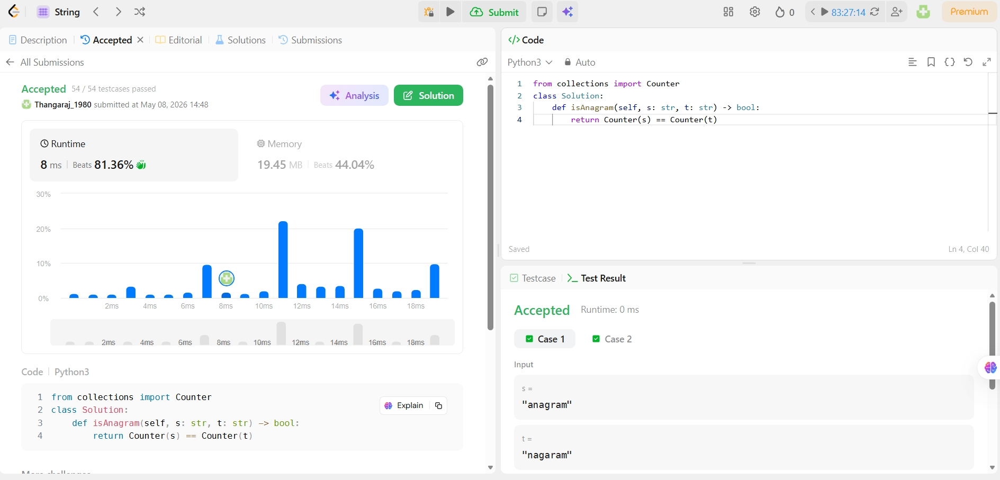

# 242. Valid Anagram 🔤


---

## 📌 Problem Statement

Given two strings `s` and `t`, return `true` if `t` is an **anagram** of `s`, and `false` otherwise.

> An **anagram** is a word or phrase formed by rearranging the letters of another word or phrase, using all the original letters exactly once.

🔗 **LeetCode Link:** [https://leetcode.com/problems/valid-anagram/](https://leetcode.com/problems/valid-anagram/)

---

## 🧪 Examples

```
Input:  s = "anagram", t = "nagaram"   →   Output: True  ✅
Input:  s = "rat",     t = "car"       →   Output: False ❌
```

**Constraints:**
- `1 <= s.length, t.length <= 5 × 10⁴`
- `s` and `t` consist of lowercase English letters

---

## 🧠 DSA Intuition

Before jumping to code, understand the **core idea**:

> Two strings are anagrams if and only if **every character appears the same number of times** in both strings.

This single insight leads to **3 different DSA approaches** — each using a different data structure and algorithmic strategy.

---

## 🚀 Approach 1 — Sorting

### 💡 Idea
Sort both strings alphabetically. If two strings are anagrams, their sorted versions will be **identical**.

```
"anagram" → sorted → ['a','a','a','g','m','n','r']
"nagaram" → sorted → ['a','a','a','g','m','n','r']
                       ✅ Equal → Valid Anagram
```

### 🔍 DSA Concept: Sorting Algorithm
- Sorting rearranges characters into a **canonical (standard) order**
- If two strings are anagrams, this canonical form is always the same
- Python's `sorted()` uses **Timsort** internally — O(n log n)

### 📝 VSCode Code

```python
s = input("Enter first string: ")
t = input("Enter second string: ")

if sorted(s) == sorted(t):
    print("Valid Anagram")
else:
    print("Not Anagram")
```

### 📸 LeetCode Submission — Sorting



> **Result:** Accepted — 54/54 test cases passed
> **Runtime:** 19 ms — Beats **15.16%**
> **Memory:** 20.36 MB — Beats **8.97%**

### ⏱️ Complexity Analysis

| | Complexity | Reason |
|---|---|---|
| **Time** | **O(n log n)** | Sorting both strings takes O(n log n) |
| **Space** | **O(n)** | `sorted()` creates a new list of size n |

### ✅ Pros & ❌ Cons
- ✅ Simplest to write and understand
- ✅ No extra data structures needed
- ❌ Slowest approach — sorting is expensive
- ❌ Higher memory usage from new list creation

---

## 🚀 Approach 2 — Hash Map (Frequency Count)

### 💡 Idea
Count how many times each character appears in **both** strings using two dictionaries. If both frequency maps are equal, the strings are anagrams.

```
s = "anagram"    countS = {a:3, n:1, g:1, r:1, m:1}
t = "nagaram"    countT = {n:1, a:3, g:1, r:1, m:1}
                            ✅ countS == countT → Valid Anagram
```

### 🔍 DSA Concept: Hash Map
- A **Hash Map (Dictionary)** stores key-value pairs with O(1) average lookup and insertion
- We use characters as **keys** and their frequency as **values**
- Comparing two hash maps tells us if character distributions are identical
- Space is bounded — only 26 keys max (lowercase English letters) = O(1) space

### 📝 VSCode Code

```python
s = input("Enter first string: ")
t = input("Enter second string: ")

if len(s) != len(t):
    print("Not Anagram")
else:
    countS = {}
    countT = {}

    for i in range(len(s)):
        countS[s[i]] = 1 + countS.get(s[i], 0)
        countT[t[i]] = 1 + countT.get(t[i], 0)

    if countS == countT:
        print("Valid Anagram")
    else:
        print("Not Anagram")
```

### 📸 LeetCode Submission — Hash Map



> **Result:** Accepted — 54/54 test cases passed
> **Runtime:** 11 ms — Beats **76.26%** 🔥
> **Memory:** 19.36 MB — Beats **75.06%** 🔥

### ⏱️ Complexity Analysis

| | Complexity | Reason |
|---|---|---|
| **Time** | **O(n)** | Single pass through both strings |
| **Space** | **O(1)** | At most 26 keys in the dictionary |

### ✅ Pros & ❌ Cons
- ✅ Optimal time complexity — O(n)
- ✅ Best for interviews — shows clear DSA thinking
- ✅ Best LeetCode performance among all 3 approaches
- ❌ More code to write compared to the one-liner

---

## 🚀 Approach 3 — Python Counter (Pythonic)

### 💡 Idea
Python's built-in `collections.Counter` automatically builds a frequency map. Comparing two `Counter` objects directly tells us if both strings have identical character distributions.

```
Counter("anagram") → Counter({'a': 3, 'n': 1, 'g': 1, 'r': 1, 'm': 1})
Counter("nagaram") → Counter({'a': 3, 'n': 1, 'g': 1, 'r': 1, 'm': 1})
                     ✅ Equal → Valid Anagram
```

### 🔍 DSA Concept: Hash Map (via Library)
- `Counter` is a **subclass of `dict`** — it's a Hash Map under the hood
- Same O(n) time and O(1) space as Approach 2
- The difference is **abstraction** — Python does the frequency counting for you
- Best used when you understand the underlying logic (Approach 2) first

### 📝 VSCode Code

```python
from collections import Counter

s = input("Enter first string: ")
t = input("Enter second string: ")

if Counter(s) == Counter(t):
    print("Valid Anagram")
else:
    print("Not Valid Anagram")
```

### 📸 LeetCode Submission — Counter (Pythonic)



> **Result:** Accepted — 54/54 test cases passed
> **Runtime:** 8 ms — Beats **81.36%** ⚡
> **Memory:** 19.45 MB — Beats **44.04%**

### ⏱️ Complexity Analysis

| | Complexity | Reason |
|---|---|---|
| **Time** | **O(n)** | Counter builds frequency map in one pass |
| **Space** | **O(1)** | At most 26 unique character keys |

### ✅ Pros & ❌ Cons
- ✅ Cleanest, most Pythonic syntax
- ✅ Fastest runtime in this problem
- ✅ Same optimal complexity as Approach 2
- ❌ Relies on library — not always allowed in interviews
- ❌ Hides the underlying logic from the reader

---

## 📊 All 3 Approaches — Side-by-Side Comparison

| Approach | Data Structure | Algorithm | Time | Space | Runtime | Beats |
|----------|---------------|-----------|------|-------|---------|-------|
| **Sorting** | List | Timsort | O(n log n) | O(n) | 19 ms | 15.16% |
| **Hash Map** | Dictionary | Frequency Count | O(n) | O(1) | 11 ms | 76.26% 🔥 |
| **Counter** | Counter (dict) | Frequency Count | O(n) | O(1) | 8 ms | 81.36% ⚡ |

### 📈 Why Hash Map beats Sorting

```
n = 50,000 characters (max constraint)

Sorting  → O(n log n) = 50,000 × 17  ≈ 850,000 operations
Hash Map → O(n)       = 50,000 × 1   ≈  50,000 operations

Hash Map is ~17x fewer operations at max input size!
```

> **Key takeaway:** Hash Map and Counter are both O(n) — Counter is slightly faster due to C-optimized internals in Python. Sorting is the slowest due to the extra log n factor.

---

## 🗂️ Project Structure

```
STRINGS/
└── 242_valid_anagram/
    ├── Hash map/
    │   └── hashmap.py          # Approach 2 — Hash Map (Frequency Count)
    ├── pythonic/
    │   └── pythonic.py         # Approach 3 — Counter (One-liner)
    ├── sorting/
    │   └── sorting.py          # Approach 1 — Sorting
    ├── screenshots/
    │   ├── hashmap.jpeg        # LeetCode submission — Hash Map
    │   ├── pythonic.jpeg       # LeetCode submission — Counter
    │   └── sorting.jpeg        # LeetCode submission — Sorting
    └── README.md
```

---

## ⚠️ Edge Cases

| Case | Input | Expected | Reason |
|------|-------|----------|--------|
| Both empty | `s=""`, `t=""` | `True` | No characters to differ |
| Different lengths | `s="ab"`, `t="a"` | `False` | Can't be anagram |
| Same chars, different count | `s="aab"`, `t="abb"` | `False` | Frequency mismatch |
| Single character match | `s="a"`, `t="a"` | `True` | Same single char |
| All same characters | `s="aaa"`, `t="aaa"` | `True` | Same frequency |

> 💡 **Interview tip:** Always check `len(s) != len(t)` first — it's an O(1) early exit that avoids unnecessary computation.

---

## 🔗 Related Problems

| Problem | Key Concept | Difficulty |
|---------|-------------|------------|
| [49. Group Anagrams](https://leetcode.com/problems/group-anagrams/) | HashMap + Sorting | Medium |
| [438. Find All Anagrams in a String](https://leetcode.com/problems/find-all-anagrams-in-a-string/) | Sliding Window + HashMap | Medium |
| [383. Ransom Note](https://leetcode.com/problems/ransom-note/) | HashMap frequency | Easy |
| [1. Two Sum](https://leetcode.com/problems/two-sum/) | HashMap lookup | Easy |

---

## 📅 Submission Log

| Date | Approach | Runtime | Beats | Status |
|------|----------|---------|-------|--------|
| May 08, 2026 | Sorting | 19 ms | 15.16% | ✅ Accepted |
| May 08, 2026 | Hash Map | 11 ms | 76.26% | ✅ Accepted |
| May 08, 2026 | Counter | 8 ms | 81.36% | ✅ Accepted |

---

## 🧩 DSA + Python Journey

> **Arrays** ✅ (10 problems completed) → **Strings** 🔄 (In Progress — Problem #1)

---

⭐ **Star this repo** if it helped you understand the approaches!
